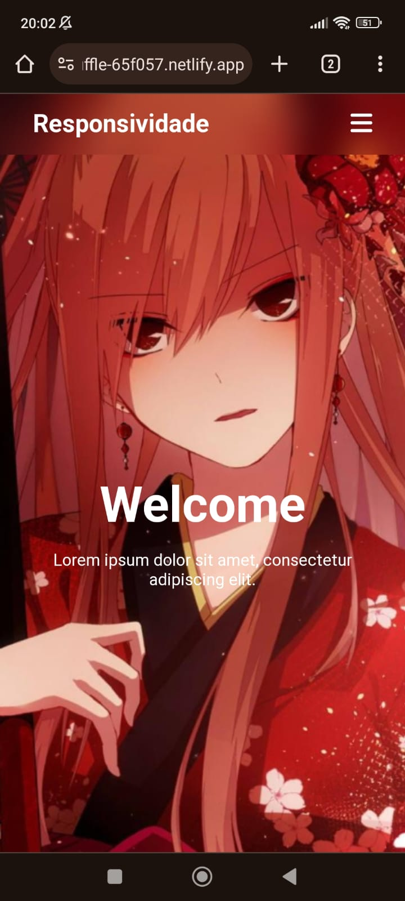
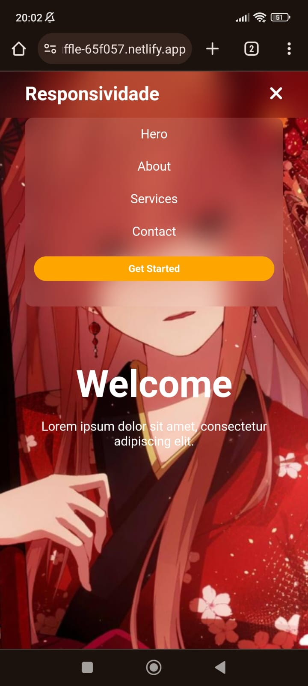

# Projeto de Relembrar Conceitos de HTML e CSS

Este é um projeto que fiz para relembrar alguns conceitos de HTML e CSS, especialmente focando na responsividade.

## Versão Desktop

## Versão Mobile

  